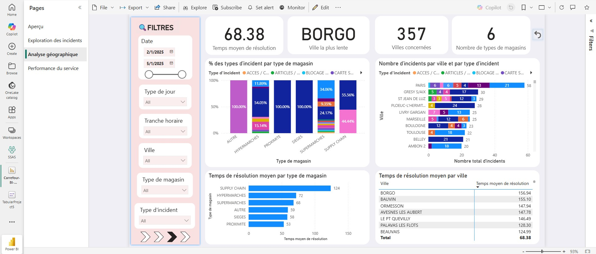
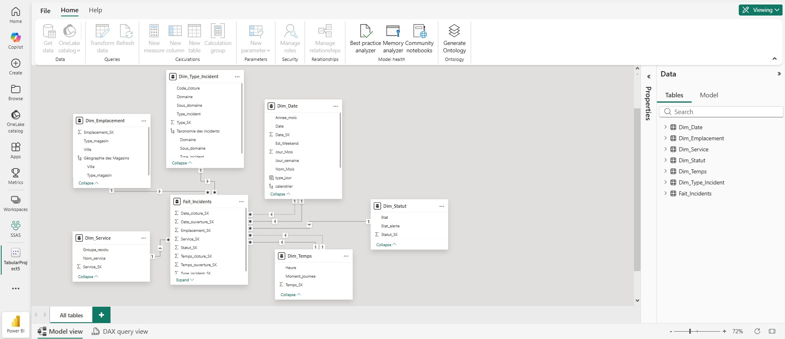
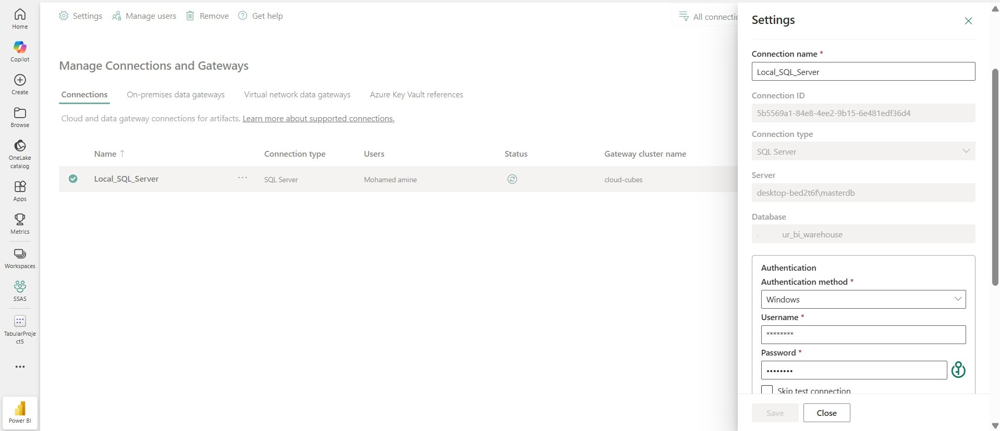
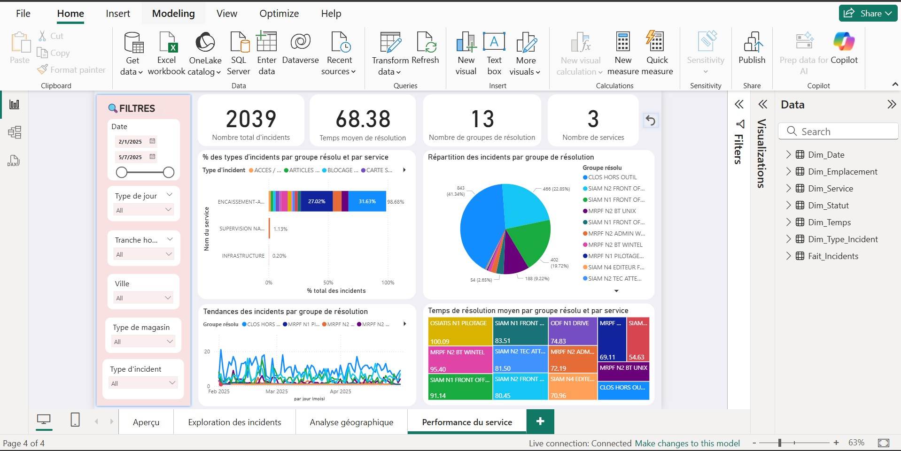
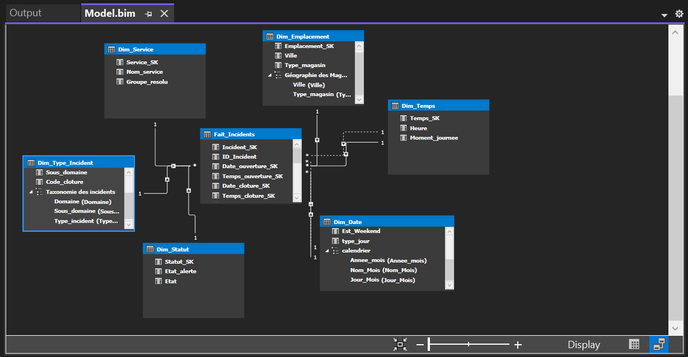
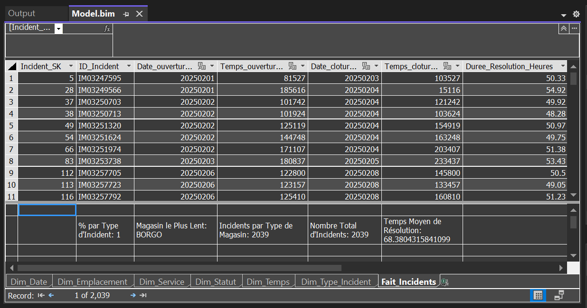
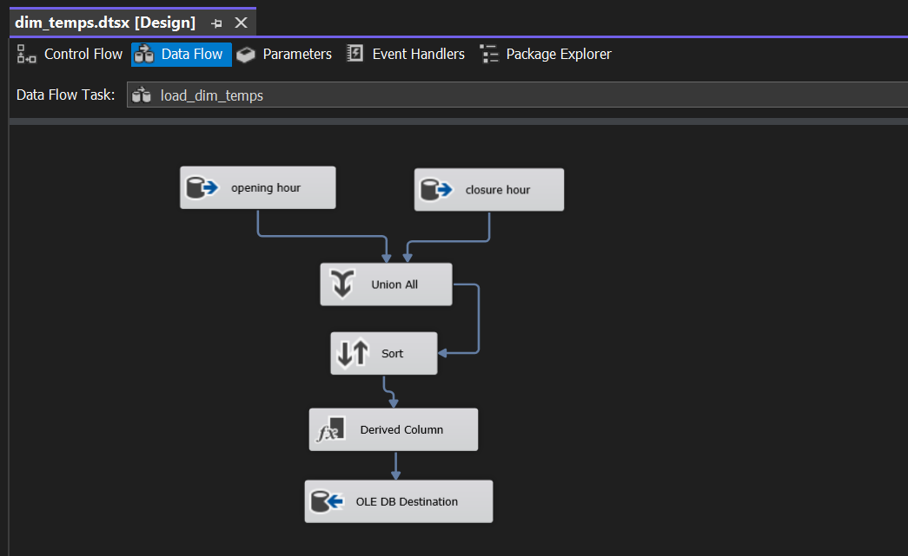
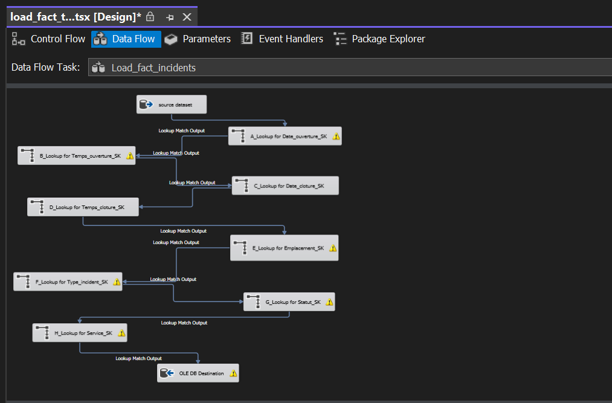

# Incident Analysis BI Project

A complete Business Intelligence solution built to analyze operational and IT incidents across a large retail network in France. Raw incident data is transformed into a fully modeled data warehouse and explored through a published Power BI dashboard. Due to confidentiality and data protection, the raw dataset, client name, and PBIX file cannot be shared. However, all technical deliverables, screenshots, and a complete static export of the dashboard are included in this repository.

---

## Project Context

The client generates a large volume of incident tickets related to store equipment, operational systems, and payment terminals. Manual analysis was slow, reactive, and created limited visibility for Level 2 support teams. This project builds a full BI system to:

- Centralize incident history into a SQL Server data warehouse  
- Cleans and enriches raw data through SQL  
- Uses SSIS for repeatable ETL operations  
- Models the data using a star schema for high performance analytics  
- Build a semantic SSAS Tabular model  
- Publish a dashboard to Power BI service connected through a data gateway

The final result is a dashboard providing insights on performance, incident types, store categories, geography, and resolution behavior.

---

## Architecture Overview

The BI solution follows a classic three layer structure based on the Kimball methodology:

1. Extraction  
   - Raw incident exports from the client's system  
   - Cleaning and transformation using SQL in SSMS

2. Storage  
   - SQL Server Data Warehouse  
   - Star schema dimensional modeling  
   - SSIS packages that load dimensions and fact tables

3. Presentation  
   - SSAS Tabular model deployed to Power BI Premium  
   - DAX measures and hierarchies  
   - Interactive dashboard published to Power BI service  
   - Static PDF export included in this repository

---

## Data Preparation and Cleaning

Data quality issues were handled entirely through SQL scripts. Key operations included:

- Imputing missing resolution groups based on logical relationships in the data
- Removing duplicate incident rows based on matching identifiers
- Standardizing categorical values including spelling variations and case inconsistencies
- Normalizing French accented characters to avoid encoding issues
- Splitting a combined location column into separate fields for city and store type
- Creating time based features such as weekday names, time of day segmentation, weekend flags, and separate date and time attributes

All transformations were executed through SQL scripts.

---

## Data Warehouse Design

A dimensional model was implemented to support fast and flexible analysis.

### Dimension tables
- Dim_Date  
- Dim_Temps  
- Dim_Emplacement  
- Dim_Type_Incident  
- Dim_Statut  
- Dim_Service  

Each table uses a surrogate key and stores attributes relevant for slicing, filtering, and categorical analysis.

### Fact table
- Fait_Incidents  

Grain: one row per incident

Contains:

- Foreign keys to each dimension table  
- Measures including resolution duration  
- Degenerate incident attributes such as ID and Title

ETL flows were implemented with SSIS and include:

- Merge source data  
- Clean and sort records  
- Generate surrogate keys, and populate all tables.

---

## Semantic Modeling in SSAS

A cloud hosted SSAS Tabular model was built on top of the data warehouse. It includes:

- Hierarchies for easy drill down  
- DAX measures such as:
  - Total incident count  
  - Average resolution time  
  - Incident share by category  
  - Store level performance ranking  

Deployment was performed to Power BI Premium and linked through an on premise data gateway to refresh data from SQL Server.

---

## Final Dashboard (Static View)

The finished static BI dashboard is available here:
[View Static BI Dashboard](https://github.com/M-Eljarroudi/incident-analysis-bi-project/blob/main/Static-BI-dashboard.pdf)

This is the main visual deliverable of the project.  

Below are screenshots captured from Power BI Service and Desktop. The images are stored within this repository and displayed inline.

### Dashboard in Power BI Service

### Dashboard in Power BI Desktop

---

## Data Modeling Screenshots

These images document the SSAS and SSIS design.

### SSAS Star Model Diagram

### SSAS Measures

### SSIS Workflows

---

## Business Insights (April 2025)

The dashboard uncovered several major operational findings:

### General observation

- 700 incidents recorded in April 2025
- Incidents occurred in 357 different cities
- Affecting 6 store types across the national network
- Average resolution time was 66.60 minutes

### Major categories

- Payment terminal failures accounted for 226 incidents  
- Reporting related issues counted 193 incidents  
- Over 60 percent of all incidents were linked to payment infrastructure and reporting processes

### Store format distribution

- Supermarkets represented 624 incidents  
- Hypermarkets accounted for 67 incidents  
- The concentration of incidents is largely driven by supermarket volume and transaction frequency

### Operational performance

- Some incident types such as performance and financial reconciliation showed significantly higher time to resolution  
- Payment terminal failures were usually resolved faster due to simpler resolution requirements

### Weekend analysis

- 65 incidents occurred during weekends in April 2025  
- Clos Hors Outil group demonstrated strong efficiency with average resolution around 51 minutes  
- SIAM Level 1 and Level 2 groups exceeded 97 minutes on average indicating more complex technical workload

These findings guided recommendations for better training or tooling for reporting workflows, resource allocation, equipment upgrades, improved preventive monitoring for payment hardware, and redistribution of support effort based on store type and peak workload periods.

---

## Files Included in This Repository

- datawarehouse_script.sql    
- Static-BI-dashboard.pdf  
- PBI_service_dashboard.jpg  
- PBI_desktop_dashboard.jpg  
- model_powerbi_service.jpg  
- gateway_PBI_service.jpg  
- SSAS_diagram.PNG  
- SSAS_measures.PNG  
- SSIS workflow files (fact and dimension flows)

---

## Tools Used

- SQL Server Management Studio  
- SQL Server Integration Services  
- SQL Server Analysis Services Tabular  
- Power BI Service  
- Power BI Desktop  
- Excel  
- Visual Studio

---

## Project Status

This project represents a complete academic capstone solution based on real operational data. While the full dynamic PBIX and dataset cannot be shared, all architecture components, code, screenshots, and the static dashboard export are included for review.

